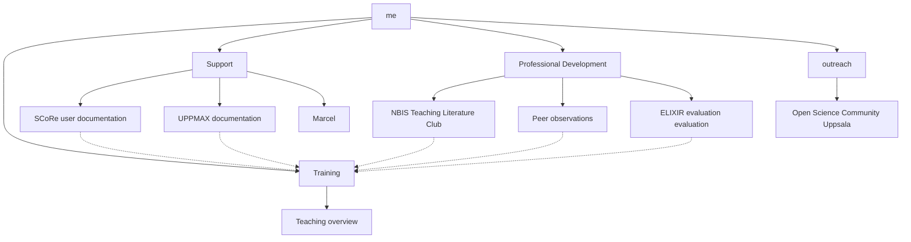
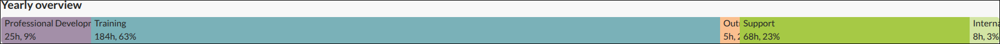
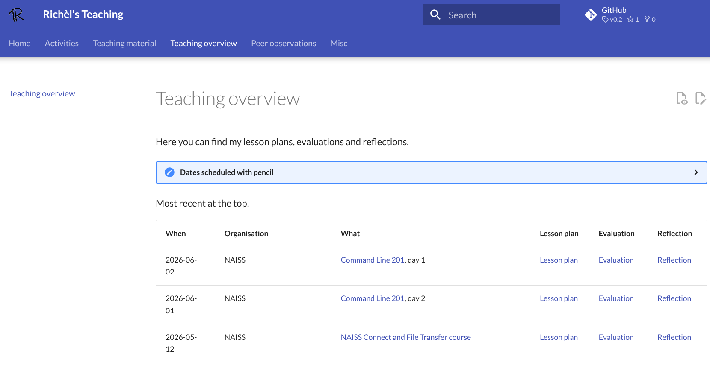
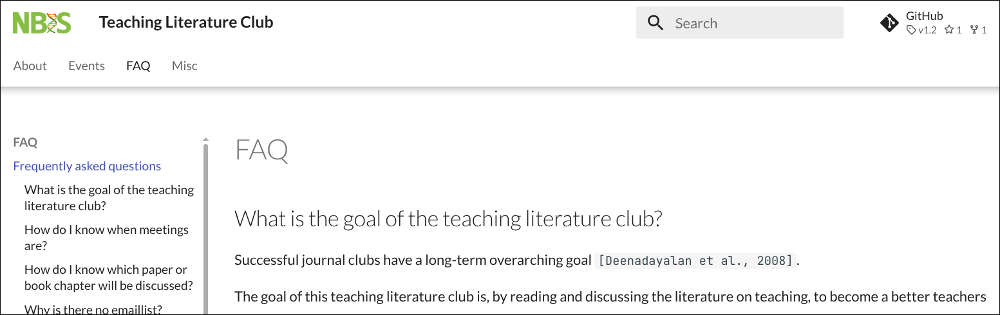
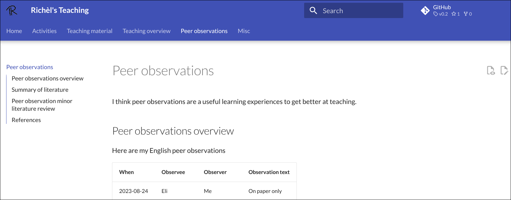
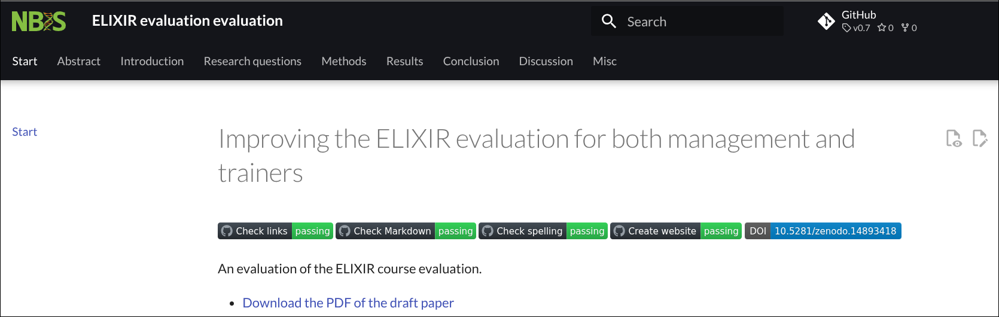
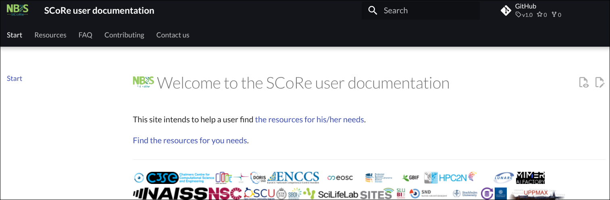
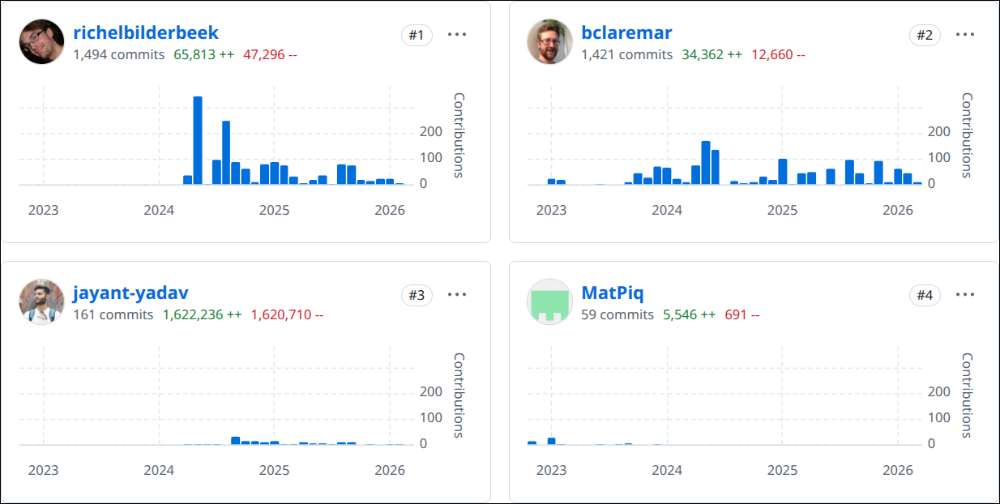
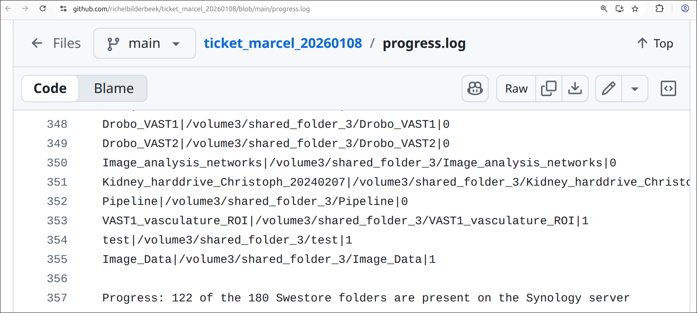
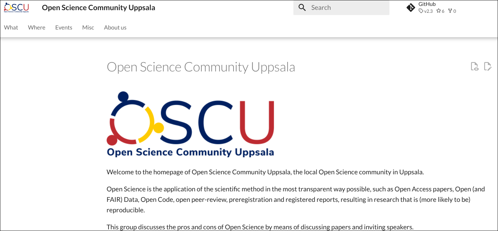

# score_presentation_richel_20260304

My presentation at SCoRe

## Goal

- To let my colleagues know what I do, so that can consider using some of it

## What I do

Percentage|Activity                 |Example
----------|-------------------------|----------------
63        | Training                |NAISS and others
23        | Support                 |SCoRe user doc, UPPMAX documentation, Marcel
9         | Professional development|TLC, peer observations, ELIXIR evaluation evaluation
3         | Internal NBIS           |.
2         | Outreach                |OSCU

## Training

From [the overview of my teaching](https://richelbilderbeek.github.io/teaching/teaching_overview/),
one can conclude I teach around once per week.

This is useful to you, if:

- want to teach
- want to assist in teaching
- you need a baseline expection about course statistics, e.g. number of
  learners actually showing up
- you need a baseline expectation of how course evaluations (by learners)
  look like
- you need an example of a (teacher) reflections

## Professsional development 1/3

Together with Elin Kronander, we lead
[the NBIS teaching literature club](https://nbisweden.github.io/teaching_literature_club/),
which takes place around once a month.

This is useful to you, if:

- you want to improve your teaching based on the academic literature

## Professsional development 2/3

With some colleagues, we are starting up a
[teaching peer observation group](https://richelbilderbeek.github.io/teaching/peer_observations),
to observe each others' teaching as equals.

This is useful to you, if:

- you want to improve your teaching (in one of the two ways) that is most
  effective
- you want to see how others teach

## Professsional development 3/3

With another colleague, we are working on
[a paper](https://nbisweden.github.io/elixir_evaluation_evaluation/)
called 'Improving the ELIXIR evaluation for both management and trainers'
with evaluates the ELIXIR/NBIS evaluation.

This is useful to you, if:

- you want to know which questions -according to the academic literature-
  are useful to ask to learners for course evaluations

## Support 1/3

I wrote and maintain
[the SCoRe user documentation](https://docs.score.nbis.se/).

This is useful to you, if:

- you want to know which courses are being taught by NAISS, SciLifeLab,
  NBIS, Mimir, etc.
- you need to get an overview of compute resources
- you need to get an overview of storage systems
- you need someone to use their HPC resources efficiently

## Support 2/3

Björn Claremar and I are heavy contributors to
[the UPPMAX documentation](https://docs.uppmax.uu.se/).
I use this documentation in teaching too, assuring that it
is kept up-to-date.

This is useful to you, if:

- you want to redirect an UPPMAX user to the documentation
- you want to show a documentation site that **shows** that the
  maintainers care about their users

## Support 3/3

I am working on a data transfer project for professor Marcel den Hoed.
The goal is to transfer his data from Swestore
(a NAISS storage system) to a within-university NAS.
My notes and scripts are a private GitHub repo.

This is useful to you, if:

- you want access to notes on how to use Swestore and Rclone

## Outreach

Together with several volunteers, I am leading
[the Open Science Community Uppsala](https://open-science-community-uppsala.github.io/open_science_community_uppsala/).

This is useful to you, if:

- you want to discuss/talk/listen about Open Science
